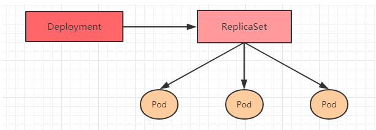
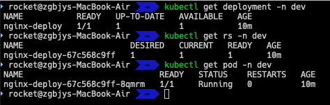
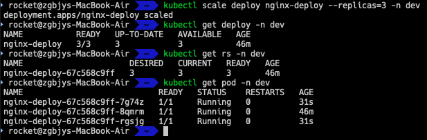
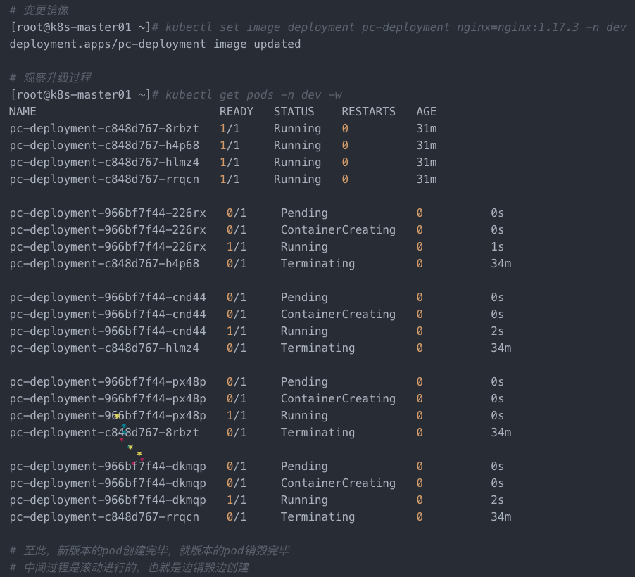

# Deployment：无状态

## 功能
1. Deployment管理Replicaset, Replicaset管理Pod






2. Deployment支持Replicaset的所有功能
   - 重启或重建pod
   - 扩容或缩容pod
   - 镜像版本的升级
3. Deployment支持滚动升级和回滚版本
4. Deployment支持发布的停止、继续

### 创建

#### shell创建

```shell
kubectl create deploy nginx-deploy -n dev --image=nginx:1.27.0
```

#### yaml创建

```shell
kubectl create -f nginx-deployment.yaml
```

[nginx-deployment.yaml](../yaml/深度调度/deployment/nginx-deployment.yaml)

#### 创建的结果

1. kubectl get deploy -n dev
   - UP-TO-DATE：当前版本的Pod数量
   - AVAILABLE：可用的Pod数量
2. kubectl get rs -n dev
   - RS的名称：deployment的名称-10位随机字符串
   - DESIRED：期望的Pod数量
   - CURRENT：当前的Pod数量
   - READY：可用的Pod数量


### 扩容缩容

```shell
kubectl scale deploy nginx-deploy --replicas=3 -n dev
```

#### 扩容缩容的结果



### 镜像更新
```yaml
strategy：指定新的Pod替换旧的Pod的策略， 支持两个属性：
  type：指定策略类型，支持两种策略
    Recreate：在创建出新的Pod之前会先杀掉所有已存在的Pod
    RollingUpdate：滚动更新，就是杀死一部分，就启动一部分，在更新过程中，存在两个版本Pod
  rollingUpdate：当type为RollingUpdate时生效，用于为RollingUpdate设置参数，支持两个属性：
    maxUnavailable：用来指定在升级过程中不可用Pod的最大数量，默认为25%。
    max违规词汇： 用来指定在升级过程中可以超过期望的Pod的最大数量，默认为25%。
```

#### 重建更新
1. kubectl edit deploy nginx-deploy -n dev
2. 修改spec.template.spec.containers.image


#### 滚动更新
1. kubectl edit deploy nginx-deploy -n dev
2. 修改spec.template.spec.containers.image
3. 查看RS, 发现新生成一个RS, 但原先RS依旧存在，只是pod数为0

##### 滚动更新的过程
   


##### 滚动更新的结果


### 回滚
```shell
kubectl rollout status deploy nginx-deploy -n dev
kubectl rollout undo deploy nginx-deploy --revision=2 -n dev
kubectl rollout history deploy nginx-deploy --revision=3 -n dev
```


### 暂停与恢复
把deploy先暂停下来，然后编辑deploy yaml，最后resume
```shell
kubectl rollout pause deploy nginx-deploy -n dev
kubectl rollout resume deploy nginx-deploy -n dev
```


## 配置信息

[nginx-deployment.yaml](./kubernetes_learning/yaml/深度调度/deployment/nginx-deployment.yaml)

### 备注

#### 关系嵌套

- deployment --> replicaset --> pod
